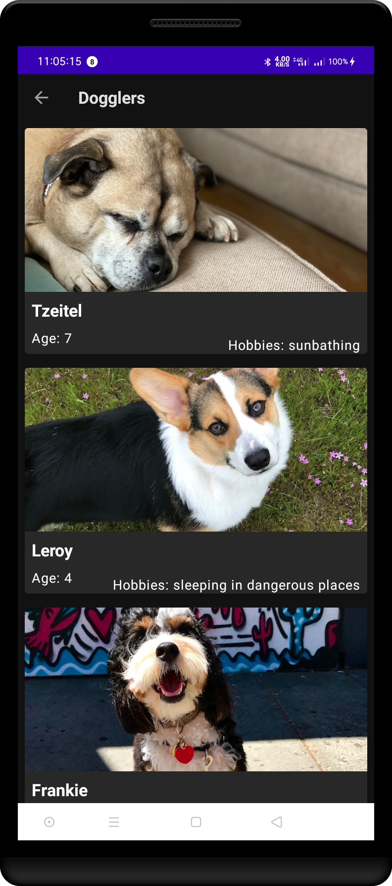
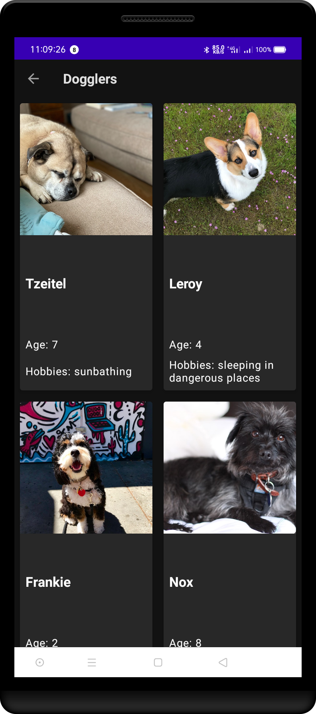

buka file `DogCardAdapter.kt` dalam file ini, selanjutnya kita akan membuat kode berfungsi!

di kelas `DogCardViewHolder` kita harus menginisialisasi dan menetapkan variabel untuk menampung data kita, yaitu data anjing.
pertama kita buat variabel yang disebut `val dogs` dan kemudian kita assign datanya dari file DataSource. kodenya akan terlihat seperti ini.

`private val dogs = DataSource.dogs`

```kt
class DogCardAdapter(
    private val context: Context?,
    private val layout: Int
): RecyclerView.Adapter<DogCardAdapter.DogCardViewHolder>() {
    private val dogs = DataSource.dogs // here is our variable
    // TODO: Initialize the data using the List found in data/DataSource
```

---

selanjutnya, kita harus mendeklarasikan dan menginisialisasi semua komponen UI item daftar di kelas `DogCardViewHolder`. berikut kode yang telah selesai.

```kt
    class DogCardViewHolder(view: View?): RecyclerView.ViewHolder(view!!) {
        // TODO: Declare and initialize all of the list item UI components
        val dogName = view?.findViewById<TextView?>(R.id.dog_name)
        val dogImage : ImageView? = view?.findViewById(R.id.dog_image)
        val dogAge : TextView? = view?.findViewById(R.id.dog_age)
        val dogHobbies: TextView? =  view?.findViewById(R.id.dog_hobbies)

    }
```

kode di atas menjelaskan bagaimana kita memegang setiap elemen UI. jangan lupa gunakan notasi elvis (?). ini karena variabel kita bisa `null`.

---

Untuk kode selanjutnya kita harus mengimplementasikan metode onCreateViewHolder dari kelas DogCardViewHolder (kelas ini diwarisi dari kelas induknya RecyclerView.ViewHolder). pada Kode ini kita harus menentukan layout mana yang akan digunakan ketika pengguna mengklik tombol Vertikal atau tombol Horizontal atau tombol Grid. kita menggunakan ekspresi `when` untuk menentukan tata letak.
perhatikan bahwa di `const/Layout.kt` kita memiliki variabel yang menyimpan nilai ini. sebagai gantinya kita dapat menggunakan 1,2 atau 3 dalam ekspresi when kita.
berikut kode yang telah selsai.

```kt
 override fun onCreateViewHolder(parent: ViewGroup, viewType: Int): DogCardViewHolder {
        // TODO: Use a conditional to determine the layout type and set it accordingly.
        //  if the layout variable is Layout.GRID the grid list item should be used. Otherwise the
        //  the vertical/horizontal list item should be used.
        val adapterLayout = when(layout){
            Layout.GRID -> LayoutInflater.from(parent.context).inflate(R.layout.grid_list_item, parent, false)
            else -> LayoutInflater.from(parent.context)
                .inflate(R.layout.vertical_horizontal_list_item, parent, false)
        }
        // TODO Inflate the layout

        // TODO: Null should not be passed into the view holder. This should be updated to reflect
        //  the inflated layout.
        return DogCardViewHolder(adapterLayout)
    }
```

kode di `when expression` menjelaskan, ketika pengguna memilih tata letak GRID kemudian inflate tata letak `grid_list_item` ke `MainActivity`, jika tidak, inflate tata letak `vertical_horizontal_list_item`.

---

selanjutnya kita harus mengimplementasikan metode `getItemCount()`. metode ini hanya mengambil satu baris, sehingga kita dapat membuat kode hanya satu baris seperti dibawah

```kt
override fun getItemCount(): Int {dogs.size}
```

atau kita bisa menggunakan kata kunci `return` agar kode mudah untuk dibaca.

```kt
override fun getItemCount(): Int {
     return dogs.size
    }
```

kode diatas mengembalikan nilai berapa banyak data kita pada variabel `dogs` yang telah kita tentukan sebelumnya

---

Langkah terakhir adalah mengimplementasikan metode onBindViewHolder() yang menetapkan nilai berbeda di seluruh item UI ViewHolder. jangan lupa untuk selalu menggunakan operator elvis (.?) atau operator panggilan aman untuk keamanan null.

```kt
    override fun onBindViewHolder(holder: DogCardViewHolder, position: Int) {
        // TODO: Get the data at the current position
        val item = dogs[position]
        // TODO: Set the image resource for the current dog
        holder.dogImage?.setImageResource(item.imageResourceId)
        // TODO: Set the text for the current dog's name
        holder.dogName?.text = item.name
        // TODO: Set the text for the current dog's age

        val resources = context?.resources
        holder.dogAge?.text = resources?.getString(R.string.dog_age, item.age)

        // TODO: Set the text for the current dog's hobbies by passing the hobbies to the
        //  R.string.dog_hobbies string constant.
        //  Passing an argument to the string resource looks like:
        //  resources?.getString(R.string.dog_hobbies, dog.hobbies)
        holder.dogHobbies?.text = resources?.getString(R.string.dog_hobbies, item.hobbies)
    }
```

## Tampilan aplikasi



<div style="text-align:center">vertical layout</div>



<div style="text-align:center">grid layout</div>


<div style="text-align:center">horizontal layout</div>
