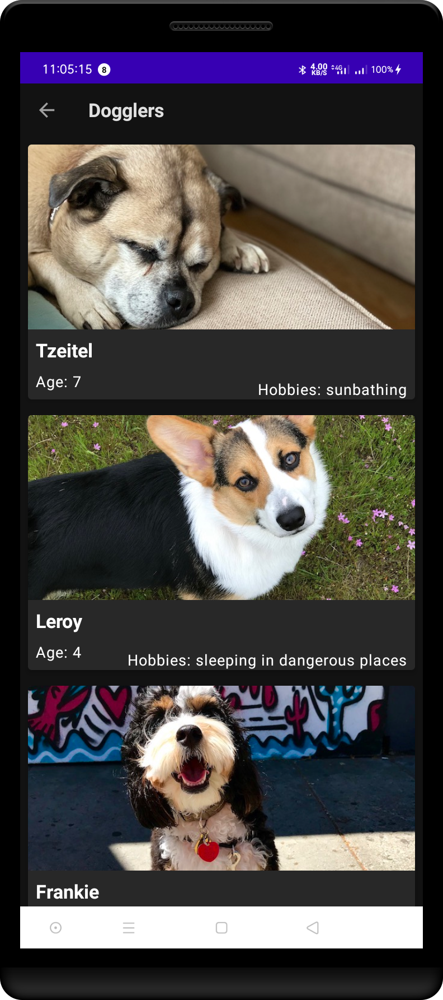
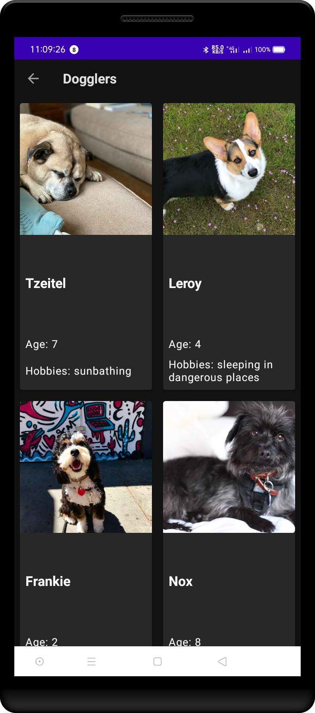
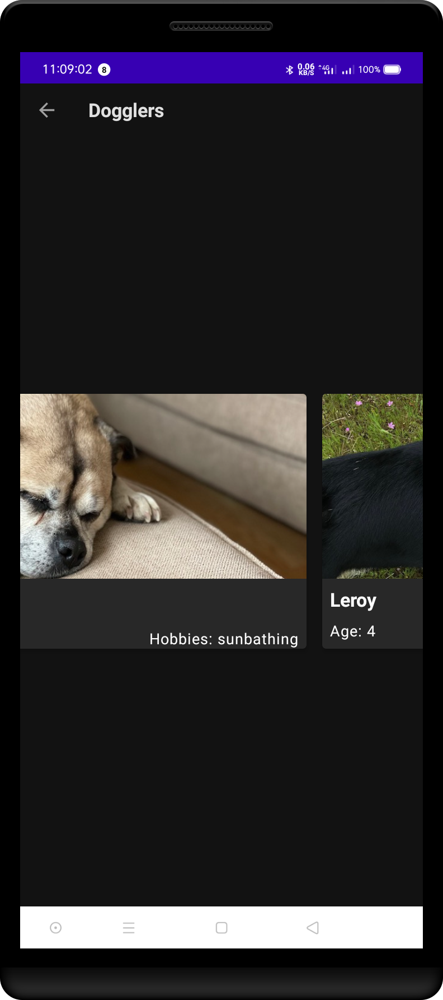

open file `DogCardAdapter.kt` in this file we will code along and make the app work!

in class `DogCardViewHolder` we have to initialize and assign variable to hol our data, that is dog data.
first we create variabel called `val dogs` and then we assign the data from DataSource file. the code should look like this.
`private val dogs = DataSource.dogs`

```kt
class DogCardAdapter(
    private val context: Context?,
    private val layout: Int
): RecyclerView.Adapter<DogCardAdapter.DogCardViewHolder>() {
    private val dogs = DataSource.dogs // here is our variable
    // TODO: Initialize the data using the List found in data/DataSource
```

---

next, we have to declare and initialize all of the list item UI components in `DogCardViewHolder` class. here is our code.

```kt
    class DogCardViewHolder(view: View?): RecyclerView.ViewHolder(view!!) {
        // TODO: Declare and initialize all of the list item UI components
        val dogName = view?.findViewById<TextView?>(R.id.dog_name)
        val dogImage : ImageView? = view?.findViewById(R.id.dog_image)
        val dogAge : TextView? = view?.findViewById(R.id.dog_age)
        val dogHobbies: TextView? =  view?.findViewById(R.id.dog_hobbies)

    }
```

the code above explains how we hold each UI elements. don't forget to use elvis notation (?). this is beacuse our variabel can be null.

---

For next code we have to implemented the onCreateViewHolder method from the DogCardViewHolder class (this class inherited from its parent class RecyclerView.ViewHolder). This code we have to determine which layout to use when user click Vertical button or Horizontal button or Grid button. we use `when`expression to determine that layout.
note that in `const/Layout.kt`we have variabel that hold this value. instead we can use 1,2 or 3 in our when expression.
here is the code should look like.

```kt
 override fun onCreateViewHolder(parent: ViewGroup, viewType: Int): DogCardViewHolder {
        // TODO: Use a conditional to determine the layout type and set it accordingly.
        //  if the layout variable is Layout.GRID the grid list item should be used. Otherwise the
        //  the vertical/horizontal list item should be used.
        val adapterLayout = when(layout){
            Layout.GRID -> LayoutInflater.from(parent.context).inflate(R.layout.grid_list_item, parent, false)
            else -> LayoutInflater.from(parent.context)
                .inflate(R.layout.vertical_horizontal_list_item, parent, false)
        }
        // TODO Inflate the layout

        // TODO: Null should not be passed into the view holder. This should be updated to reflect
        //  the inflated layout.
        return DogCardViewHolder(adapterLayout)
    }
```

the code in `when expression` explains, when user choose GRID layout then inflate `grid_list_item` layout to the `MainActivity`, else inflate `vertical_horizontal_list_item` layout.

---

next we have to implement `getItemCount()` method. this method just take one line, so we can make the code just one line

```kt
override fun getItemCount(): Int {dogs.size}
```

or we can use return keyword so it's easy to read our code.

```kt
override fun getItemCount(): Int {
     return dogs.size
    }
```

code above return our data size. which is our variable data called dogs.

---

Finally, the last step was to implement the onBindViewHolder() method which sets the different values across the ViewHolder UI items. don't forget to always using the elvis operator (.?) or safe call operator for null-safety.

```kt
    override fun onBindViewHolder(holder: DogCardViewHolder, position: Int) {
        // TODO: Get the data at the current position
        val item = dogs[position]
        // TODO: Set the image resource for the current dog
        holder.dogImage?.setImageResource(item.imageResourceId)
        // TODO: Set the text for the current dog's name
        holder.dogName?.text = item.name
        // TODO: Set the text for the current dog's age

        val resources = context?.resources
        holder.dogAge?.text = resources?.getString(R.string.dog_age, item.age)

        // TODO: Set the text for the current dog's hobbies by passing the hobbies to the
        //  R.string.dog_hobbies string constant.
        //  Passing an argument to the string resource looks like:
        //  resources?.getString(R.string.dog_hobbies, dog.hobbies)
        holder.dogHobbies?.text = resources?.getString(R.string.dog_hobbies, item.hobbies)
    }
```

## here is our app look like.



<div style="text-align:center">vertical layout</div>



<div style="text-align:center">grid layout</div>



<div style="text-align:center">horizontal layout</div>
